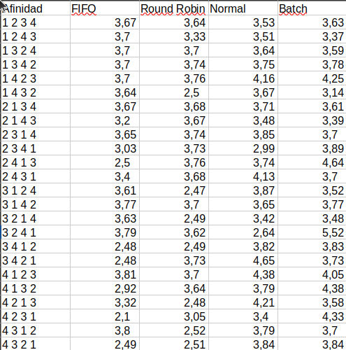
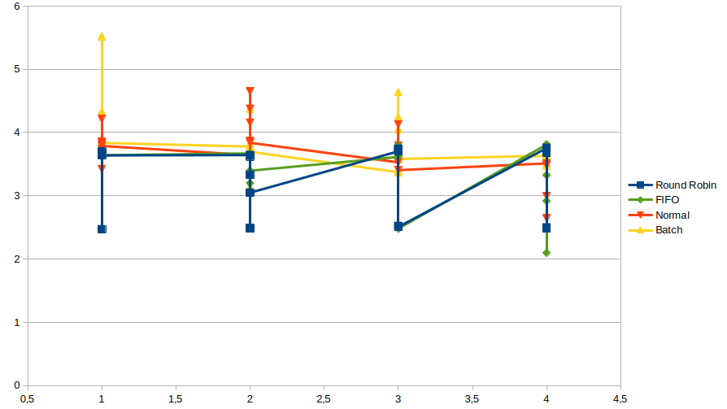
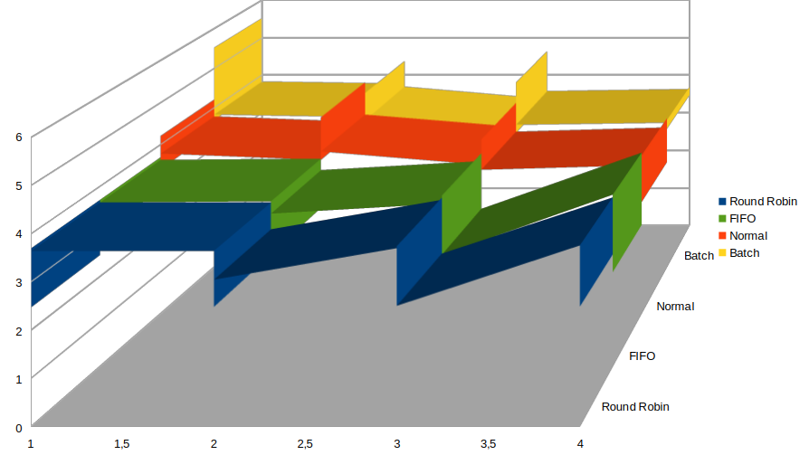

# sistopo_2

En esta actividad se crearon 24 codigos, cada uno con un orden distinto en las afinidades, de manera que cada algoritmo de planificacion tuviera una afinidad distinta.

SCHED_FIFO y SCHED_RR son políticas de tiempo real que garantizan que los procesos se ejecuten de forma ininterrumpida durante su tiempo de ejecución asignado.
SCHED_OTHER es la política de planificación predeterminada de Linux, que utiliza un enfoque de reparto justo de CPU entre los procesos. 
SCHED_BATCH es una política para procesos por lotes que no requieren una respuesta interactiva rápida.

En general, las políticas de tiempo real (FIFO y Round Robin) tienden a tener tiempos de ejecución más cortos para tareas intensivas de CPU, como el cálculo de números primos, ya que garantizan que los procesos reciban su tiempo de CPU asignado sin interrupciones. Por otro lado, la política SCHED_OTHER, al ser la predeterminada, también muestra un buen rendimiento, ya que realiza una distribución justa de los recursos de CPU entre los procesos. La política SCHED_BATCH, al tener una prioridad más baja, suele tardar más en ejecutarse.

